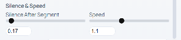
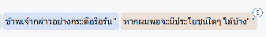

# Audiobook QA Criteria for Narration Books (v2) — ต้นฉบับภาษาไทย

เอกสารนี้คือคู่มือการตรวจสอบคุณภาพ (QA) ที่ผู้ตรวจใช้จริงในสายงานผลิตหนังสือเสียง
และเป็นเกณฑ์เดียวกับที่ใช้ติดป้ายกำกับ (label) ทุก segment ในชุดข้อมูลนี้

> **หมายเหตุ** หมวด **ความสม่ำเสมอ (Consistency)** ของคู่มือต้นฉบับถูกตัดออกจากเอกสารฉบับนี้
> เนื่องจากเป็นเกณฑ์ที่ประเมินในระดับทั้งเล่ม/ทั้ง chunk ไม่ใช่ระดับ segment เดี่ยว
> จึงไม่ได้ถูกนำมาใช้ติดป้ายกำกับในชุดข้อมูลนี้
>
> ฉบับแปลภาษาอังกฤษอยู่ที่ [`qa-criteria-en.md`](qa-criteria-en.md)

---

### **ภาพรวมขั้นตอนการตรวจสอบคุณภาพ (Overview of QA Process)**

ขั้นตอนการ QA จะแบ่งการทำงานออกเป็น 2 ส่วนหลัก เพื่อให้มั่นใจในคุณภาพของงานเสียงก่อนส่งมอบ:

* **Part-time QA:** ทำการตรวจสอบและแก้ไขแบบร่าง (Draft) ทั้งหมดในเบื้องต้น  
* **Lead QA (การสุ่มตรวจ):** หลังจาก Part-time QA ตรวจสอบเสร็จสิ้น Lead QA จะทำการสุ่มตรวจไฟล์เสียงในสัดส่วน **10% ของความยาวเสียงทั้งหมด** โดยการสุ่มนี้จะไม่ใช่การฟังต่อเนื่องจุดเดียว แต่จะเป็นการสุ่มฟังช่วงสั้นๆ กระจายไปทั่วทั้งไฟล์เพื่อให้ครอบคลุม 10% นั้น  
* **การคำนวณเกณฑ์ (Parameter):** เราจะใช้ค่า **`<จำนวนนาทีที่สุ่ม>`** เป็นเกณฑ์มาตรฐานในการประเมินจุดผิดพลาด โดยมีแนวคิดพื้นฐานคือ ใน 1 นาทีของไฟล์เสียง ควรมีจุดที่ผิดพลาดหรือไม่เหมาะสมไม่เกิน 1 จุดโดยเฉลี่ย

**แนวทางการตรวจและเกณฑ์การตีกลับงาน (Reject Criteria) สำหรับ Lead QA:**

* **การรวบรวมคอมเมนต์:** เนื่องจากเป้าหมายคือ 0 Error หาก Lead QA สุ่มฟังแล้วพบข้อผิดพลาด (แม้จะเจอตั้งแต่ประโยคแรก) **อย่าเพิ่งหยุดตรวจแล้วตีกลับทันที** ให้ทำการสุ่มฟังต่อไปอีกระยะหนึ่งเพื่อรวบรวมคอมเมนต์ให้ครอบคลุมที่สุด เพื่อให้ผู้แก้ไขเห็นข้อผิดพลาดในจุดอื่นๆ และนำไปปรับปรุงได้ในรอบเดียว  
* **จุดตัดสำหรับการหยุดตรวจทันที:** หากระหว่างการสุ่มตรวจ พบจุดผิดพลาดร้ายแรงสะสมมากถึง **`<จำนวนนาทีที่สุ่ม>/2` จุด** (เช่น สุ่มตรวจ 10 นาที แต่เจอจุดผิดไปแล้วถึง 5 จุดในช่วงแรกๆ) Lead QA สามารถ **หยุดการตรวจและตีกลับงานชิ้นนั้นได้ทันทีโดยไม่ต้องฟังส่วนที่เหลือต่อ** เพราะถือว่าไฟล์นั้นมีปัญหามากเกินกว่าจะตรวจต่อจนจบ

1. **ความถูกต้องของการอ่านออกเสียง (Pronunciation & Text Accuracy)** 

   **เป้าหมายหลัก (Zero Tolerance): ต้องไม่มีข้อผิดพลาดในหมวดนี้เลย (0 Errors)** ไฟล์เสียงที่ผ่านเกณฑ์จะต้องมีการอ่านออกเสียงและอ่านตาม Script ถูกต้อง 100%

   

   

   การแบ่งเกณฑ์ ถูก/ผิด

1. อ่านซ้ำคำ 

   อ่านพยางค์หรือคำจาก script ซ้ำมากกว่าหนึ่งรอบ ซึ่งส่วนใหญ่เกิดจากการ 

   Regenerate แต่ Trim Audio ไม่ครบ แก้ไขโดยการเข้าไปกด Trim Audio แล้วเลื่อนช่วงเสียง

   	“ครั้งแล้วครั้งเล่าที่ข้าพเจ้าตั้งปณิธานแน่วแน่”

   [ตัวอย่างการอ่านที่ถูกต้อง](https://drive.google.com/file/d/10WOzyDyjs9uIobIQosd986PT0bZ7zM2j/view?usp=drive_link) ครั้งแล้วครั้งเล่าที่ข้าพเจ้าตั้งปณิธานแน่วแน่ 

   [ตัวอย่างที่ไม่ถูกต้อง](https://drive.google.com/file/d/1Li_UT-Uz3fHk8fWxYfylyzak5KSbqV4w/view?usp=sharing) ครั้งแล้วครั้งเล่าที่ข้าพเจ้าตั้งปณิธานแน่วแน่ แน่

   

2. อ่านข้ามพยางค์หรือคำ

   อ่านข้ามพยางค์หรือคำจาก script อาจจะเกิดขึ้นจาก AI ไม่เข้าใจในการอ่านตัว

   สะกดหรือเกิดจากการ Regenerate แก้ไขได้ด้วยการ prompt คำสั่งหรือการ Regenerate ใหม่ 

   	“ครั้งแล้วครั้งเล่าที่ข้าพเจ้าตั้งปณิธานแน่วแน่”

   [ตัวอย่างการอ่านที่ถูกต้อง](https://drive.google.com/file/d/10WOzyDyjs9uIobIQosd986PT0bZ7zM2j/view?usp=drive_link) ครั้งแล้วครั้งเล่าที่ข้าพเจ้าตั้งปณิธานแน่วแน่

   [ตัวอย่างที่ไม่ถูกต้อง](https://drive.google.com/file/d/1wetlWX2fqdy0SxABssDZP_uDVv5-PGE8/view?usp=sharing) ครั้งแล้ว\_\_ที่ข้าพเจ้าตั้งปณิธานแน่วแน่

   

3. อ่านผิดตัวสะกด

   อ่านผิดตัวสะกดจาก script อาจจะเกิดขึ้นจาก AI ไม่เข้าใจในการอ่านตัวสะกดหรือเกิดจากการ Regenerate แก้ไขด้วยการ prompt คำสั่งหรือการ Regenerate ใหม่ 

   “แหม จะกล่าวเช่นนั้นก็คงเกิดไปหน่อย”

   [ตัวอย่างการอ่านที่ถูกต้อง](https://drive.google.com/file/d/1r2EagFQ2DwLa4Hy6esJLUQs8gZ5yfLMj/view?usp=sharing)  “แหม จะกล่าวเช่นนั้นก็คงเกินไปหน่อย

   [ตัวอย่างที่ไม่ถูกต้อง](https://drive.google.com/file/d/1OTE5aatb1TzfQksQCZyGabyCnHrTK8Ju/view?usp=sharing) แหม จะกล่าวเช่นนั้นก็คงเกิดไปหน่อย

   

4. อ่านผิดวรรณยุกต์

   อ่านผิดวรรณยุกต์จาก script อาจจะเกิดขึ้นจาก AI ไม่เข้าใจในการอ่านวรรณยุกต์ หรือเกิดจากการ Regenerate แก้ไขได้ด้วยการ prompt คำสั่งหรือการ Regenerate ใหม่ 

   “ครั้งแล้วครั้งเล่าที่ข้าพเจ้าตั้งปณิธานแน่วแน่”

   [ตัวอย่างการอ่านที่ถูกต้อง](https://drive.google.com/file/d/10WOzyDyjs9uIobIQosd986PT0bZ7zM2j/view?usp=drive_link) ครั้งแล้วครั้งเล่าที่ข้าพเจ้าตั้งปณิธานแน่วแน่

   [ตัวอย่างที่ไม่ถูกต้อง](https://drive.google.com/file/d/1R90wpp0G_BnZOek133iEAMlsDl832a8X/view?usp=sharing) ครั้งแล้วครั้งเล่าที่ข้าพเจ้าตั้งปณิธานแนวแน่

   

5. การอ่านไม้ยมก (ๆ)

   การอ่านไม้ยมก (ๆ) แบบอ่านซ้ำผิดคำหรือพยางค์อาจจะเกิดขึ้นจาก AI ไม่เข้าใจในการอ่านไม้ยมก (ๆ) อาจจะไม้อ่านหรืออ่านไม้ยมกซ้ำมากกว่า 2 ครั้ง เลือกการอ่านไม้ยมก (ๆ) ให้เหมาะสมกับบริบท

   “รายละเอียดอื่นๆ ยังต้องนำมาประกอบกันอีก”

   [ตัวอย่างการอ่านที่ถูกต้อง](https://drive.google.com/file/d/1Q1OFkgIlB9FkNdLRwf823jh2zGXQOJ7h/view?usp=sharing) รายละเอียดอื่นอื่น ยังต้องนำมาประกอบกันอีก

    [ตัวอย่างที่ไม่ถูกต้อง](https://drive.google.com/file/d/1bbloipwxskgm04OHs8zn0fvCoUxKimiQ/view?usp=sharing) รายละเอียดอื่น ยังต้องนำมาประกอบกันอีก

   

6. การอ่านในวงเล็บ

   การอ่านซ้ำในวงเล็บ () หากอ่านซ้ำให้เลือกอ่านเพียง 1 ครั้งเท่านั้น ไม่อ่านซ้ำซ้อน

   “มิสมอร์สแตน (Morstan) ห่อหุ้มร่างกายด้วยเสิ้อคลุมสีเข้ม”

   [ตัวอย่างการอ่านที่ถูกต้อง](https://drive.google.com/file/d/1eARWTo22K0xXqqlLXG_9W967Wa7aghcI/view?usp=sharing) 

   [ตัวอย่างที่ไม่ถูกต้อง](https://drive.google.com/file/d/1F6WdAQp3x64HsNZlbewR2AOhbh3-gnK1/view?usp=sharing) มิสมอร์สแตน (Morstan) ห่อหุ้มร่างกายด้วยเสิ้อคลุมสีเข้ม

   

2. **อารมณ์ จังหวะ และความเหมาะสมของการอ่าน (Tone, Pacing & Context)**   
   **เกณฑ์การประเมิน:** มีจุดที่ไม่เหมาะสมได้ไม่เกิน **`<จำนวนนาทีที่สุ่ม>` จุด** (เฉลี่ยไม่เกิน 1 จุด ต่อ 1 นาทีที่สุ่มฟัง)  
   1. ความเร็วในการอ่าน  
      เกิดจากการ Regenerate แก้ไขได้โดยการกดปรับตรง speed เลื่อนไปทางขวา  
      คืออ่านเร็วขึ้น เลื่อนไปทางซ้ายอ่านช้าลง แต่ถ้าไม่สามารถแก้ไขให้ดูเป็นธรรมชาติเสียงการอ่านดูแข็งๆให้ทำการพิมพ์คำส้่ง prompt หรือ Regenerate  
        
      [ตัวอย่างการอ่านที่ถูกต้อง](https://drive.google.com/file/d/10WOzyDyjs9uIobIQosd986PT0bZ7zM2j/view?usp=drive_link) “ครั้งแล้วครั้งเล่าที่ข้าพเจ้าตั้งปณิธานแน่วแน่”  
      [ตัวอย่างที่ไม่ถูกต้อง](https://drive.google.com/file/d/16jVv5K-tp_EuilTWaOZZVosgG23ZIF4j/view?usp=sharing) : เร็วเกินไป [ตัวอย่างที่ไม่ถูกต้อง](https://drive.google.com/file/d/11Heb-P1-U59AsYvGJ3rBp0dhgRu3h6A1/view?usp=sharing) : ช้าเกินไป

        
   2. การแบ่งช่องไฟ 2 segment (การเว้นวรรคการอ่าน)  
      เกิดจาก Silence After Segment ตั้งไว้น้อยหรือมากเกินไป แก้ไขโดยการปรับ ถ้าปรับไปทางซ้าย (น้อยลง) ช่องไฟระหว่าง segment 1 และ 2 เว้นน้อยเกินไป แต่ถ้าปรับไปทางขวาช่องไฟหลังจบ segment 1 ก็จะพูดช้าลงในการพูดต่อ segment 2 เว้นมากเกินไป          ข้อควรระวัง ต้องหมั่นเช็คช่องไฟ บางที Silence After Segment เท่ากันแต่เวลาฟังในภาพรวมการอ่านเชื่อมต่อกันของแต่ละ segment มีการเว้นช่องไฟที่แตกต่างกัน  
        
      

      “ข้าพเจ้ากล่าวอย่างกระตือรือร้น segment 1  
      หากผมพอจะมีประโยชน์ใดๆ ได้บ้าง" segment 2 

      [ตัวอย่างการอ่านปกติ](https://drive.google.com/file/d/1togxlMITR9RwRfVK1zentYvFlQMDWRqS/view?usp=sharing) segment 1 Silence After Segment 0.3  (ปกติ)  
        
      เว้นมากเกินไป [ตัวอย่างที่ไม่ถูกต้อง](https://drive.google.com/file/d/1togxlMITR9RwRfVK1zentYvFlQMDWRqS/view?usp=sharing)

      segment 1 Silence After Segment 0.9  (เว้นมากเกินไป)

      เว้นน้อยเกินไป [ตัวอย่างที่ไม่ถูกต้อง](https://drive.google.com/file/d/1HJd2wNgEnNynvHn919t1LeNc0kFD4ZwA/view?usp=sharing)

      segment 1 Silence After Segment 0.18 (เว้นน้อยเกินไป)

   3. การอ่านออกเสียงไม่ตรงกับบริบท   
      เกิดจาก AI ไม่เข้าใจในการอ่าน หรือเกิดจากการ Regenerate ใหม่แล้วแสดงน้ำเสียงที่แสดงถึงอารมณ์และไม่ตรงกับบริบท แก้ไขได้ด้วยการ prompt คำสั่งหรือการ Regenerate ใหม่ แบ่งออกได้อีกเป็น   
      บทบรรยาย 

      “จากอิตาลี พวกท่านเดินทางไปเยือนเยอรมณีและฝรั่งเศส”  
      [ตัวอย่างการอ่านปกติ](https://drive.google.com/file/d/1bzzv-2zC306mBZlbFX2FC-vMmH1sZrwX/view?usp=sharing)   
      [ตัวอย่างที่ไม่ถูกต้อง](https://drive.google.com/file/d/1fd0dyV3a83gIk9ogo6aRtwyuGboi-eAC/view?usp=sharing) 

      บทพูด

      “มิตรสหายเช่นนั้นจะช่วยแก้ไขข้อบกพร่องของพี่ชายผู้น่าสงสารของเธอได้มากเพียงใดหนอ”  
      [ตัวอย่างการอ่านปกติ](https://drive.google.com/file/d/12HrivAp-j76TRNJFQ_5ZKNqvcLwKpofI/view?usp=sharing)    
      [ตัวอย่างที่ไม่ถูกต้อง](https://drive.google.com/file/d/1RxaCMQr1NeqjW_SDG4gyLTerHmwt3XMl/view?usp=sharing) (ใส่อารมณ์เกินบริบท)  
        
   4. การสื่ออารมณ์และโทนเสียง  
      เกิดจาก AI ไม่เข้าใจในการอ่าน หรือเกิดจากการ Regenerate ใหม่แล้วแสดงน้ำเสียงที่แสดงถึงอารมณ์และโทนเสียง แก้ไขได้ด้วยการ prompt คำสั่งหรือการ Regenerate ใหม่ แบ่งออกได้อีกเป็น   
      	[ตัวอย่างการอ่านปกติ](https://drive.google.com/file/d/1Yrw4VCVZ8aIs8cTYdYxplWR8CrdFOGiY/view?usp=sharing)  “ท่ามกลางฝูงชนอันมืดครึ้ม “ช่างเป็นสตรีที่เปี่ยมเสน่ห์เสียนี่กระไร\!\!” ข้าพเจ้าร้องอุทาน พลางหันไปหาเพื่อนร่วมห้อง”  
         	i. เสียงราบเรียบ ไร้อารมณ์ (Monotone แบบแบนไปเลย)

      [ตัวอย่างที่ไม่ถูกต้อง](https://drive.google.com/file/d/1OCxNoIU5gzT_x-q2WyruGFJ-mUj1NCn1/view?usp=sharing)

      Ii. อารมณ์ล้นเกินพอดี (Overacting)

      [ตัวอย่างที่ไม่ถูกต้อง](https://drive.google.com/file/d/1UeuyQyy3Uq94ivOEW-d8SahIfj1n4Yrs/view?usp=sharing)

   5. น้ำหนักเสียงและการเน้นคำ  
      เกิดจาก AI ไม่เข้าใจในการอ่าน หรือเกิดจากการ Regenerate ใหม่แล้วการแสดงน้ำเสียง ที่เน้นคำซึ่งแตกต่างกับบริบทที่อยู่ใน segment เดียวกัน แก้ไขได้ด้วยการ prompt คำสั่งหรือการ Regenerate ใหม่ แบ่งออกได้อีกเป็น   
         	i. เน้นคำผิดจุด  
      [ตัวอย่างการอ่านปกติ](https://drive.google.com/file/d/1e40dpbVRy06w6JVuJhwlIAD_5zvL7CNv/view?usp=sharing) “โดยให้ที่อยู่คือโรงแรมแลงแฮม”  

      [ตัวอย่างที่ไม่ถูกต้อง](https://drive.google.com/file/d/1SDhtf99vtWC_OIdYI7_oQ6opuxGldAYB/view?usp=sharing)

         	Ii. เสียงแข็งไม่เป็นธรรมชาติ (จังหวะ Pitch เพี้ยน ฟังดูเหมือนหุ่นยนต์อ่านหนังสือ)  
      [ตัวอย่างการอ่านปกติ](https://drive.google.com/file/d/16riHQInBqCRinuiQ5rRXMoFpxg53XE6L/view?usp=sharing) “หากเขาไม่ได้เพลิดเพลินไปกับพรอันประเสริฐข้อนี้”

      [ตัวอย่างที่ไม่ถูกต้อง](https://drive.google.com/file/d/1aUUFy1aknmtd9UjwXitRneGzOpTzJBAQ/view?usp=sharing)  
        
   6. เสียงการอ่านถูกตัดก่อนจบประโยค   
      เกิดจาก Trim Audio ตัด segment ตรงช่วงท้ายพอดีเลยทำให้เสียงตัด ฟังแล้วรู้สึกสะดุด สามารถแก้ไขได้จากการเข้าไปกด Trim Audio แล้วเลื่อนช่วงเสียง  
      “แผนการของข้าพเจ้า ซึ่งข้าพเจ้าก็เปิดเผยต่อเขาโดยมิได้ปิดบัง”

      [ตัวอย่างการอ่านปกติ](https://drive.google.com/file/d/1H_5GOugDBWvCiLmOoJ82XusQFTJbSEuA/view?usp=sharing)   
      “แผนการของข้าพเจ้า ซึ่งข้าพเจ้าก็เปิดเผยต่อเขาโดยมิได้ปิดบัง”

      [ตัวอย่างที่ไม่ถูกต้อง](https://drive.google.com/file/d/1_wcNLqsninnGZ7dOfk40Ok7EN4wXutQw/view?usp=sharing)  
        
   7. เสียงการอ่านมีการเว้นวรรคหลายวรรคไม่เป็นธรรมชาติ   
      เกิดจาก AI มีข้อผิดพลาดในการอ่านหรือเกิดจากการ Regenerate สามารถเลือกแก้ได้จากการ prompt หรือการ Regenerate ใหม่จนกว่าจะมีการอ่านเว้นวรรคที่เป็นธรรมชาติ

      “ท่านคงไม่ทำเช่นนั้นแน่หากท่านได้พบเขา ท่านได้รับการอบรมสั่งสอนและขัดเกลามาด้วยตำรา” [ตัวอย่างการอ่านปกติ](https://drive.google.com/file/d/11dvgpBizr3ywtIXaijnPBAN5FkqyAw-2/view?usp=sharing)   
      “ท่านคงไม่ทำเช่นนั้นแน่\_หากท่าน\_ได้พบเขา ท่านได้รับการอบรมสั่งสอนและขัดเกลา\_มาด้วยตำรา” [ตัวอย่างที่ไม่ถูกต้อง](https://drive.google.com/file/d/1ci0nKDMLOqit3ZvUpqu3In8Cvq7yW03K/view?usp=sharing) 
